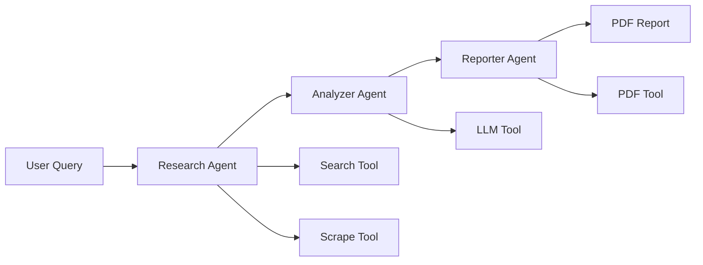

# 🤖 Competitor Research Agent

[](https://python.org)
[](LICENSE)
[](https://ai.google.dev)
[](https://crewai.com)

> **Advanced AI-powered competitive intelligence system** that automates competitor research, analysis, and professional report generation using multi-agent architecture.

## ✨ Key Features

🔍 **Intelligent Web Search** - AI-optimized competitor discovery with query enhancement  
🕷️ **Advanced Web Scraping** - JavaScript-enabled content extraction with Playwright  
🤖 **Multi-Agent Architecture** - Specialized AI agents for research, analysis, and reporting  
🧠 **AI-Powered Analysis** - Gemini 2.0 Flash for deep competitive insights  
📄 **Professional Reports** - Executive-grade PDF reports with charts and tables  
⚡ **Smart Rate Limiting** - Intelligent retry logic with exponential backoff  
🔧 **Extensible Framework** - Modular design for easy customization  
🛡️ **Security First** - Secure API key management and input validation  

## 🚀 Quick Start

### Prerequisites
- Python 3.8 or higher
- Google Cloud account (for Gemini API)
- 500MB+ free disk space

### Installation

1. **Clone the repository**
```bash
git clone <your-repo-url>
cd competitor-research-agent
```

2. **Set up virtual environment**
```bash
python -m venv venv
source venv/bin/activate  # On Windows: venv\Scripts\activate
```

3. **Install dependencies**
```bash
pip install -r requirements.txt
playwright install  # Install browser for scraping
```

4. **Configure API keys**
```bash
# Copy environment template
cp .env.example .env

# Edit .env file and add your API key:
GEMINI_API_KEY=your_actual_api_key_here
```

> 📋 **Get Gemini API Key**: Visit [Google AI Studio](https://aistudio.google.com/) → Sign in → "Get API key" → Create new key

5. **Run your first analysis**
```bash
python main.py "competitors to OpenAI"
```

## 💡 Usage Examples

### Basic Usage
```bash
# Analyze specific company competitors
python main.py "competitors to Tesla"

# Research industry segments  
python main.py "top fintech companies 2024"

# Product category analysis
python main.py "project management tools comparison"
```

### Advanced Usage
```bash
# Check configuration
python main.py --config-check

# Verbose logging
python main.py --verbose "cloud computing providers"

# Custom output filename
python main.py --output "custom_report.pdf" "AI image generation tools"

# Show usage examples
python main.py --examples
```

### Query Types That Work Best
- **Company Analysis**: "competitors to [Company Name]"
- **Industry Research**: "top [industry] companies 2024"
- **Technology Comparison**: "[technology] platforms comparison" 
- **Market Segments**: "[niche] market leaders"
- **Geographic Focus**: "European SaaS companies"

## 🏗️ Architecture

The system uses a sophisticated **multi-agent architecture** powered by CrewAI:



### Agents Overview

| Agent | Role | Capabilities |
|-------|------|-------------|
| 🔍 **Researcher** | Competitor Discovery | Web search, data collection, website scraping |
| 🧠 **Analyzer** | Intelligence Analysis | Data processing, insight generation, comparative analysis |
| 📄 **Reporter** | Report Generation | Professional formatting, executive summaries, recommendations |

### Technology Stack

- **AI Framework**: CrewAI for agent orchestration
- **LLM**: Google Gemini 2.0 Flash Experimental  
- **Web Search**: DuckDuckGo API (ddgs)
- **Web Scraping**: Playwright browser automation
- **PDF Generation**: ReportLab with professional styling
- **Configuration**: Environment variables with validation
- **Testing**: pytest with comprehensive test suite

## 📊 Sample Output

The system generates professional PDF reports containing:

✅ **Executive Summary** with key findings  
✅ **Competitor Landscape** overview with company profiles  
✅ **Market Analysis** with positioning insights  
✅ **Strategic Recommendations** for competitive advantage  
✅ **Detailed Analysis** with supporting data  
✅ **Professional Formatting** with charts and tables  

## 🔧 Configuration

### Environment Variables

| Variable | Description | Required |
|----------|-------------|----------|
| `GEMINI_API_KEY` | Google Gemini API key | ✅ Yes |
| `GROQ_API_KEY` | Groq API key (fallback) | ⚠️ Optional |
| `LOG_LEVEL` | Logging verbosity | ⚠️ Optional |
| `MAX_RETRIES` | API retry attempts | ⚠️ Optional |
| `MAX_SEARCH_RESULTS` | Search results limit | ⚠️ Optional |

### Rate Limiting

The system includes intelligent rate limiting:
- **Automatic retry** with exponential backoff
- **Multiple API providers** for redundancy  
- **Configurable delays** and retry counts
- **Error categorization** for better handling

## 🧪 Testing

Run the comprehensive test suite:

```bash
# Run all tests
pytest tests/ -v

# Run specific test categories
pytest tests/test_tools.py -v          # Tool tests
pytest tests/test_enhanced_tools.py -v # Enhanced functionality
pytest tests/test_workflow.py -v       # Workflow tests

# Run with coverage
pytest tests/ --cov=src --cov-report=html
```

### Test Categories
- **Unit Tests**: Individual component testing
- **Integration Tests**: Cross-component functionality  
- **Mock Tests**: API interaction testing
- **Error Handling**: Edge case and failure scenarios

## 🔒 Security

### API Key Security
- ✅ Environment variable storage only
- ✅ `.env` file in `.gitignore`
- ✅ No hardcoded credentials
- ✅ Secure configuration validation

### Input Validation  
- ✅ Query sanitization and validation
- ✅ URL filtering and validation
- ✅ Safe PDF generation
- ✅ Error boundary protection

### Rate Limiting
- ✅ Intelligent retry mechanisms
- ✅ Respectful scraping delays
- ✅ API quota management
- ✅ Graceful degradation

## 📈 Performance

### Typical Performance Metrics
- **Analysis Time**: 2-5 minutes per query
- **Memory Usage**: ~500MB during execution
- **API Calls**: 5-15 calls per analysis
- **Report Size**: 1-5MB PDF output
- **Concurrent Agents**: 3 (sequential processing)

### Optimization Features
- **Query optimization** for better search results
- **Result filtering** and ranking
- **Intelligent caching** (configurable)
- **Resource monitoring** and management

## 🛠️ Customization

### Adding New Tools
```python
from crewai.tools import BaseTool

class CustomTool(BaseTool):
    name: str = "Custom Analysis Tool"
    description: str = "Your tool description"
    
    def _run(self, input_data: str) -> str:
        # Your custom logic
        return "Analysis result"
```

### Modifying Agents
```python
# Customize agent parameters in src/agents/
researcher = Agent(
    role="Your Custom Role",
    goal="Your specific goal",
    backstory="Agent background",
    tools=[YourCustomTool()],
    max_iter=5,  # Adjust iterations
    max_execution_time=600  # Adjust timeout
)
```

### Custom Report Templates
Modify `src/tools/pdf_tool.py` to customize:
- Report styling and colors
- Section organization
- Chart and table formats
- Branding elements

## 🐛 Troubleshooting

### Common Issues

**"API Rate Limits Exceeded"**
```bash
# Solution: Wait and retry, or upgrade API tier
python main.py --verbose "your query"  # Check exact error
```

**"Configuration Validation Failed"**
```bash
# Solution: Check API keys
python main.py --config-check
```

**"Search Failed"**
```bash
# Solution: Check internet connection and try different query
python main.py "simpler query terms"
```

**"PDF Generation Failed"**
```bash
# Solution: Check file permissions and disk space
ls -la  # Check permissions
df -h   # Check disk space
```

### Getting Help

1. **Check logs**: Enable verbose mode with `--verbose`
2. **Validate config**: Run `python main.py --config-check`  
3. **Try examples**: Run `python main.py --examples`
4. **Check tests**: Run `pytest tests/ -v`

## 📚 Documentation

- **API Reference**: See inline docstrings in source code
- **Architecture Guide**: Check `src/` directory structure
- **Configuration Guide**: Review `.env.example`
- **Testing Guide**: See `tests/` directory

## 🤝 Contributing

We welcome contributions! Please:

1. Fork the repository
2. Create a feature branch
3. Add comprehensive tests
4. Update documentation
5. Submit a pull request

### Development Setup
```bash
# Install development dependencies
pip install -r requirements-dev.txt

# Run pre-commit hooks
pre-commit install

# Run full test suite
pytest tests/ --cov=src
```

## 📄 License

This project is licensed under the MIT License - see the [LICENSE](LICENSE) file for details.

## 🙏 Acknowledgments

- **CrewAI** - Multi-agent framework
- **Google Gemini** - Advanced AI capabilities  
- **DuckDuckGo** - Privacy-focused search
- **Playwright** - Modern web scraping
- **ReportLab** - Professional PDF generation

## 📞 Support

- **Documentation**: Check inline code documentation
- **Issues**: Open GitHub issues for bugs
- **Discussions**: Use GitHub discussions for questions
- **Email**: [ridamchhapiya15@gmail.com]

---

**Built with ❤️ using AI-powered automation**

*Transform hours of manual competitor research into minutes of intelligent analysis.*
